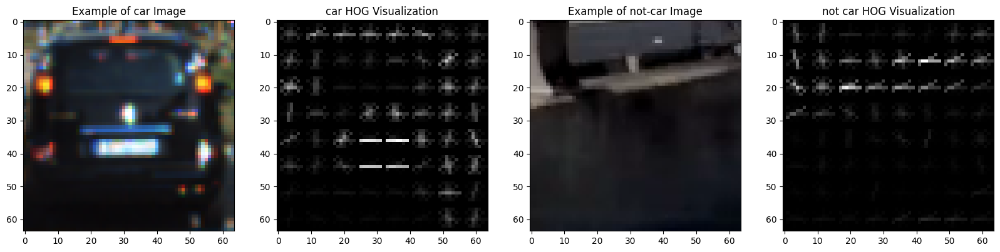
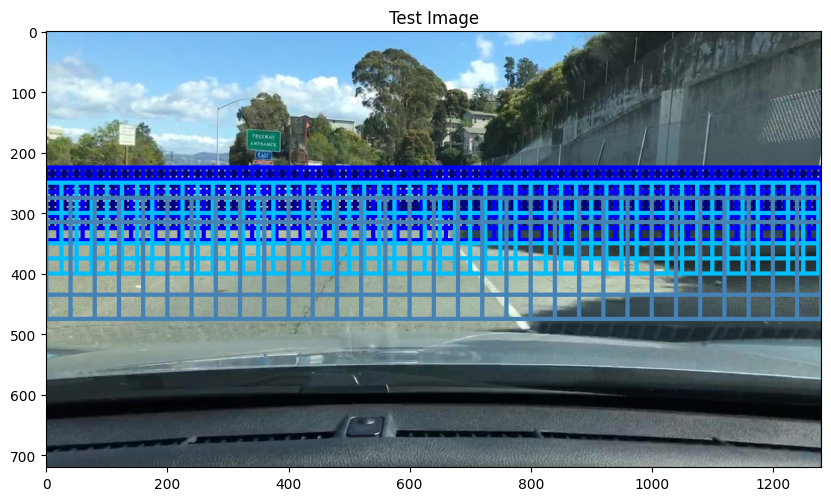
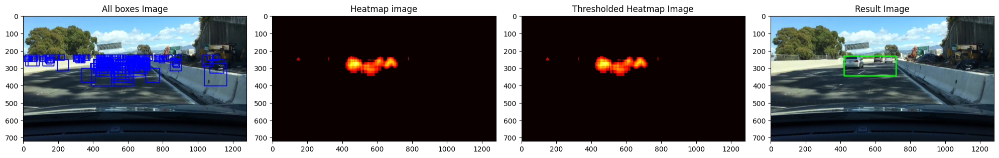

# Dashcam Vehicle Detection with Computer Vision using HOG features
### Developed by Jules GIRAUD

This repository contains a solution to detect vehicles from dashcam videos using traditional computer vision techniques. The solution is implemented in Python and involves the use of HOG (Histogram of Oriented Gradients) features, color histograms, and spatial binning to train a classifier for vehicle detection.

The repository includes various modules that handle different aspects of the pipeline, from data exploration and preprocessing to feature extraction and bounding box prediction.

## Repository Structure

- `dashcam_vehicle_detection.ipynb`: The main Jupyter notebook containing the implementation and evaluation of the vehicle detection pipeline.
- `hog.py`: Contains functions related to HOG feature extraction, color histogram computation, and spatial binning of images.
- `detector.py`: Implements the sliding window approach for vehicle detection and various utility functions to visualize and aggregate bounding boxes.
- `data_exploration.py`: Contains functions to explore and visualize the dataset.
- `utils.py`: Contains utility functions that aid in various tasks, like converting bounding boxes to binary masks and run-length encoding.
- `requirements.twt`: To install all the libraries needed to run the project.

## Setup

1. Clone the repository:
```
git clone https://github.com/GiraudJules/dashcam_vehicle_detection.git
```
2. Navigate to the cloned directory:
```
cd dashcam_vehicle_detection
```
3. (Optional) Create a virtual environment:
```
python -m venv venv
source venv/bin/activate
```
4. Install the required packages:
```
pip install -r requirements.txt
```
5. Launch Jupyter Notebook:
```
jupyter notebook
```
6. Open the `dashcam_vehicle_detection.ipynb` notebook and run the cells to execute the pipeline.

## Dataset

The dataset used for this project consists of dashcam frames with labeled bounding boxes around vehicles. The data was sourced from a Kaggle competition and includes a `train/` directory with training frames and a `test/` directory with test frames for prediction.
To train my model I used an other dataset :
[”Vehicle Detection Image Set”](https://www.kaggle.com/datasets/brsdincer/vehicle-detection-image-set) found on Kaggle. This dataset consists of 17,760 labeled images, with 8,968 non-vehicle and 8,792 vehicle instances. Each image has a resolution of 64x64 pixels and contains three color channels (RGB). I did not apply any preprocessing steps at the beginning, as the dataset was already well-organized and suitable for training purposes.

## Approach

The solution involves the following steps:

1. Data Exploration: Analyzing the dataset to understand its structure and characteristics.
2. Feature Extraction: Using HOG, color histograms, and spatial binning to extract features from the images.

3. Sliding Window Search: Implementing a sliding window approach to search for vehicles in different parts of the image.


4. Classifier Training: Using the extracted features to train a classifier to detect vehicles.
5. Bounding Box Prediction: Using the trained classifier to predict bounding boxes in test frames.

